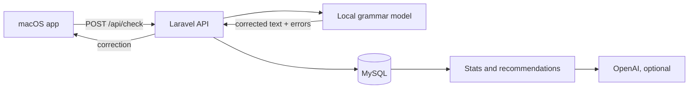

# LangCoach

LangCoach is a local grammar-coaching prototype. A native macOS menu-bar app watches
the focused editable field through the Accessibility API, sends a completed sentence
to this Laravel API, and shows a suggested correction. Changed corrections and their
individual errors are saved for statistics and recommendations.

> [!WARNING]
> This is a prototype that demonstrates the main idea. Some processes and approaches
> are deliberately simplified, and the project is not production-ready.

The macOS client is maintained in the
[LangCoach macOS repository](https://github.com/v-lavr/lang-coach-mac-os).

## Main flow



All API routes require a Sanctum Bearer token. The macOS app sends only the completed
sentence, never the entire document. Password and secure fields are not read.

## Requirements

- PHP 8.3 or later
- Composer
- MySQL and the PHP `pdo_mysql` extension
- Python 3.10 or later for the bundled local grammar model
- Python packages: `fastapi`, `uvicorn`, `transformers`, `torch`, and `pydantic`
- Xcode 15 or later to build the
  [macOS app](https://github.com/v-lavr/lang-coach-mac-os)
- An OpenAI API key only for `GET /api/recommendations`

## Install and run

### 1. Configure Laravel

```bash
composer install
cp .env.example .env
php artisan key:generate
```

Set the following values in `.env`:

```dotenv
DB_CONNECTION=mysql
DB_HOST=127.0.0.1
DB_PORT=3306
DB_DATABASE=lang_coach
DB_USERNAME=your_user
DB_PASSWORD=your_password

GRAMMAR_MODEL_URL=http://127.0.0.1:8001/correct
GRAMMAR_MODEL_TIMEOUT=5
```

Then create the schema:

```bash
php artisan migrate
```

Herd serves this project locally at `https://lang-coach-s.test`. If the site has not
already been linked and secured in Herd, do that first through Herd's Site Manager.

### 2. Start the local grammar model

From this repository:

```bash
python3 -m venv .venv
source .venv/bin/activate
pip install fastapi uvicorn transformers torch pydantic
uvicorn ai.app:app --host 127.0.0.1 --port 8001
```

The first start downloads `thenHung/english-grammar-error-correction-t5-seq2seq`.
Keep this process running while using `/api/check`.

### 3. Create a development token

```bash
php artisan app:create-development-token
```

Copy the printed token. It is shown only once and must not be committed. This is a
prototype-only authentication method; production should use Google OAuth/OIDC (or an
equivalent flow) and Keychain-backed credentials.

### 4. Build and configure the macOS app

Clone the [LangCoach macOS repository](https://github.com/v-lavr/lang-coach-mac-os),
open `LangCoachApp.xcodeproj` in Xcode, and run the `LangCoachApp` scheme. Grant
Accessibility permission when prompted, then open Settings and enter:

- **API URL:** `https://lang-coach-s.test`
- **Bearer token:** the development token from the previous step

Type a completed sentence in TextEdit. The app calls `POST /api/check`; if the API
returns a correction, LangCoach shows a popup where you can Ignore or Replace it.

## API

- `POST /api/check` — checks and saves changed corrections
- `GET /api/stats` — returns user-scoped correction and error statistics
- `GET /api/recommendations` — generates recommendations from aggregated errors;
  requires `OPENAI_API_KEY`

See [docs/api.md](docs/api.md) for request examples, response contracts, and manual
API testing steps.
